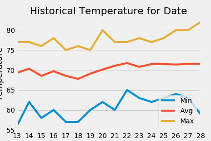

# sqlalchemy-challenge

In this assignment, the goal was to analyze the weather patterns and preciptation in Hawaii.  The dataset included data from 2010 to 2017. There were a few days out of the month where "I" chose to go on vacation, and historical weather patterns were gathered from those dates. 

The precipitation values were gathered for the last 12 months and plotted on  .

Data was gathered for the last year of the dataset of the most active station (the station with the most number of observations) at 

In the Climate App, Flask was made as an app.py file in this repository.  The flask app interacted with the database of Hawaii temperature measurements. 

A Temperature Analysis was performed.  Statistical analysis with a T-test yielded results that proved that the weather in June and December has a difference of 4 degrees (75 vs 71) and was statistically significat.  

The average rainfall was taken for the trip dates, and there was not much precipitation (a range of 0.02 to 1.36 inches of rain).

For the vacation dates, that I chose in between March 13 and March 28 (2017), the min, avg, and max temperature was taken of the data going back to 2010.  Chart here: 

And the historical temperature was more precisely plotted in 